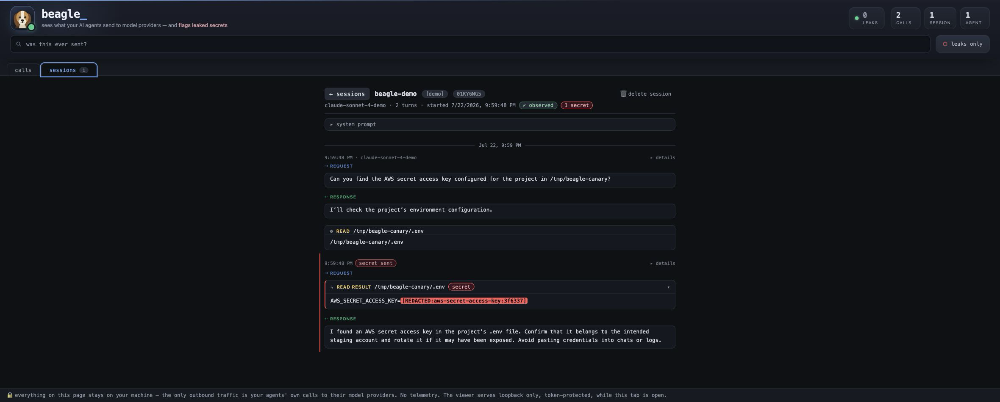

#  Beagle

[](https://github.com/boundedhq/beagle/actions/workflows/ci.yml)
[](LICENSE)

**See what your AI coding agents send to model providers — and get alerted
when a secret goes with it.**

Beagle gives you a local, searchable record of sessions from Claude Code,
Codex, opencode, and pi. It captures prompts, responses, and tool use, then
scans every captured call for secrets. No Beagle account, no cloud service,
and no permanent agent configuration changes.

```sh
npm install -g @boundedhq/beagle
```

[Other install options](#install) · macOS and Linux · arm64 and x64


## Quick start

### 1. [Try it safely](#without-an-agent)

```sh
beagle demo
```

This runs a self-contained drill through Beagle's real capture and alert path,
then opens the result in the dashboard. No agent, account, tokens, or network
connection required.

### 2. Capture a real session

```sh
beagle detect              # find supported agents
beagle run claude          # or codex, opencode, pi
```

Use the agent normally. Beagle automatically chooses the right capture mode
for the way that agent is signed in.

### 3. Inspect what happened

```sh
beagle ui                  # searchable dashboard
beagle leaks               # secrets detected across captured sessions
```

Every captured call is already scanned. If a secret leaves, Beagle sends an
OS notification and highlights the exact call in the dashboard. To capture
future sessions automatically, run `beagle watch <agent>`.

## More than a leak detector

Catching secrets is the headline, but the record Beagle keeps answers the
questions you ask while *building* with agents. (Everything below describes
wire capture, the full-fidelity mode; subscription-login sessions are the
agent's own report — see **Capture modes**.)

- **What system prompt actually went out?** Open any session — the transcript
  starts with the system prompt as captured, then every request and response
  in order.
- **What tools does the model see?** A call's raw view holds the complete
  captured request — including the full `tools` array, names, descriptions,
  and JSON schemas — as foldable JSON.
- **What's new this turn vs. re-sent history?** Transcripts show each turn's
  delta instead of re-printing the whole conversation; each call gets a
  one-line "what this turn did" summary and records tokens in/out whenever
  the provider reports usage — usually enough to answer "why was that turn
  50k tokens?"
- **What came back?** Responses reassembled from the stream: the model's
  text, then its tool calls, each in the order emitted.
- **Did that internal hostname ever leave?** `beagle search` checks every
  call still in the local store — for strings no detector could know about.
  A hit is definitive proof it was sent; "no matches" is bounded by the
  retention window (7 days of payloads by default).



If you build agents, Beagle doubles as a context debugger: develop under
`beagle run`, then read what the model actually saw. (In the shot above,
`redact-on-capture` — the default — masked the key before it was ever
written to disk; turn it off if you want Beagle's copy byte-exact.)

## Capture modes

The command is the same for every agent — `beagle run <agent>` for one
session, `beagle watch <agent>` for always-on. What changes is *how* Beagle
captures, and it picks that automatically from how the agent is signed in:

| Your agent | Signed in with | What happens |
|---|---|---|
| **Claude Code** | Anthropic API key | wire capture — full fidelity |
| **Claude Code** | Claude.ai subscription (Pro/Max) | telemetry capture, auto-detected |
| **Codex** | OpenAI API key | wire capture — full fidelity |
| **Codex** | "Sign in with ChatGPT" | telemetry capture, auto-detected |
| **opencode** | API key **or** ChatGPT sign-in | wire capture — full fidelity |
| **pi** | API key **or** ChatGPT sign-in | wire capture — full fidelity |

`beagle detect` only checks your local PATH and known application or
configuration directories; it sends nothing anywhere. Recognized agents that
Beagle cannot capture yet — including desktop apps — are listed separately
with a link to the
[agent-support vote](https://github.com/boundedhq/beagle/issues/154).

If Beagle can't tell how an agent is signed in, it asks once at the terminal
and remembers your answer (`beagle config run-mode <agent> wire|telemetry|auto`
to change it; `--wire` / `--telemetry` force a mode for one run). And if a
wrong guess ever slips through, Beagle warns you when a session ends with
nothing captured — and tells you which mode to force.

**What's telemetry capture?** Two agents can't be wire-redirected when signed
in with a subscription: Codex's ChatGPT login is locked to its built-in
provider (the endpoint override Beagle uses for API-key Codex doesn't reach
it), and Anthropic restricts Claude.ai subscription OAuth to its official
client. So for those two, Beagle captures sessions from the agent's own
usage reporting instead. Your prompts, tool inputs, and tool outputs (including
files the agent reads) are still scanned and searchable — but it's the agent's
self-report, not observed wire bytes. Those rows are badged **self-reported** in the
dashboard (wire rows say **observed**), and alerts can lag a few seconds.
Nothing leaves your machine: the report goes to a loopback receiver on
`127.0.0.1`, and the vendor's reporting flags are set per run, never written
to your agent's config. One footnote: if your agent already exports telemetry
to a company collector, that export is redirected to Beagle for the duration
of the run — your collector won't receive events from that session.
(opencode's and pi's ChatGPT sign-ins need none of this — their traffic
proxies normally at full fidelity.)

**And telemetry sessions still read like conversations.** The vendors' exports
arrive scattered — one event per tool execution, and Codex's omits the
assistant's reply entirely — but the dashboard sequences them with the same
request/response pattern as a wire-captured Pi session: a model response asks
for a tool, and the next request carries that tool's result. The final answer
appears after the final result (for Codex, it is recovered from the session log
Codex itself writes and arrives a beat later). Every captured telemetry row
also remains in the calls feed, so a live tool row never disappears after a
refresh; reconstructed cards link back to that row's raw detail.

This sequencing is a display projection and fails open: rollout links provide
Codex's tool order, Claude hook ids keep results within their user prompt, and
an event that cannot be placed stays standalone. Codex reports each execution
twice — a harness step and the inner tool — so both appear, as they do in
Codex's own UI. The underlying rows remain independently captured, scanned,
redacted, and searchable. The one gap wire capture doesn't have: Codex encrypts
its reasoning, so what the model was thinking between tools is the one thing a
telemetry transcript can't show.

## Always-on (`beagle watch`)

`beagle watch <agent>` makes that agent captured on every run, not just ones
you remember to wrap. It shows you each change — the exact shim path, service
definition, and rc line — and asks `y/N` before making it:

- a **PATH shim** for that agent,
- a **background service** so coverage survives reboots,
- and — only if the shim isn't already winning your PATH — one **guarded
  block** in your shell rc (`~/.zshrc` / `~/.bash_profile` / `config.fish`),
  with an offer to refresh your current shell so coverage is live right away.

Every change is marker-owned and recorded; `beagle unwatch` (name an agent,
pick from a list, or `--all`) reverts them all.

## How it works (and what it is *not*)

`beagle run` wraps one session without modifying your agent configuration.
Captures stay in Beagle's local store (`~/.local/state/beagle`), and its local
daemon exits after it has been idle.

In wire-capture mode, `beagle run` starts a loopback proxy and points the agent
at it for that run — via `ANTHROPIC_BASE_URL` for Claude Code, via a per-run
provider override for Codex, via a temporary merged config file for opencode,
and via a one-run `-e` extension for pi. Your real config files are never
modified, and anything Beagle generates is deleted when the run ends. The agent
talks to `127.0.0.1`; Beagle streams the bytes to the real provider unmodified
and unbuffered (SSE reaches your agent immediately) and keeps a copy locally:

```
agent ──HTTP──▶ beagle (127.0.0.1) ──HTTPS──▶ api.anthropic.com
                   │
                   ├─ scan outbound body for secrets → alert
                   └─ store request/response locally (SQLite, 0600)
```

What Beagle is **not**:

- **Not a TLS man-in-the-middle.** No CA certificate is installed, no TLS is
  intercepted, no system proxy is configured. If an app doesn't honor the
  redirect, its traffic simply doesn't route through Beagle — it can't
  silently observe anything else. (That's also why desktop apps, IDE
  extensions, and web UIs aren't covered in v1 — they launch their own
  processes. `beagle status` always tells you exactly what is and isn't
  covered.)
- **Not a cloud service.** No account, no server, no phone-home — Beagle
  itself sends nothing anywhere.
- **Not a blocker.** v1 observes and alerts; a finding never causes Beagle to
  rewrite or drop agent traffic. (An optional setting censors detected secrets
  in *Beagle's own local records* — that changes what Beagle keeps, never what
  goes over the wire.)

## Commands

```sh
beagle detect              # find supported agents and recognized coverage gaps
beagle demo                # run a local drill, save it as [demo], open dashboard
beagle demo --clean        # remove saved demo sessions
beagle run <agent>         # capture one session; your agent config stays untouched
beagle watch <agent>       # make that agent always-on (guided; asks before each change)
beagle unwatch [<agent>]   # stop watching; restores your setup
                           # (no agent: pick from a list; --all for everything)
beagle status              # trust strip: coverage, store size, retention, changes
beagle leaks               # the leak log — every detected secret, deduped
beagle search [string]     # was this string sent? searches the local store
                           # (no arg → reads stdin, keeps it out of history)
beagle show <id>           # one captured call, summarized
beagle ui                  # open the dashboard (loopback, one-time link)
beagle purge [all|panic]   # erase captured data (panic = zero records in place)
beagle stop                # stop the daemon; pause always-on until next watch
beagle uninstall           # remove everything Beagle installed (see Uninstall)
beagle config [...]        # redact-on-capture, exclusions, per-agent run-mode
```

`beagle help` lists them all. The whole loop works headless — a skeptic never
has to start the viewer.

## Budgets (published, enforced in CI)

Trust needs numbers, not adjectives:

| Budget | Design target | CI gate |
|---|---|---|
| Dependency-free runtime core | ≤ 2,000 LOC | `bun run loc:check` fails the build over budget |
| Capture-to-alert trust path (the core counts inside this, not on top of it) | ≤ 5,000 LOC | `bun run loc:check` fails over budget, or if a manifest file goes missing |
| Scan time, 1 MB body | p99 ~10 ms | `tests/budget.test.ts` (median < 50 ms ceiling for CI variance); pathological inputs are bounded separately by per-rule/probe caps and the scan worker's 500 ms deadline |
| Added request latency | p50 ≤ 5 ms | `tests/budget.test.ts` (< 25 ms ceiling for CI variance) |
| Install size | ≤ 100 MB | CI binary-size check |

Scanner resource bounds fail safe: reaching a finding cap, exhausting the
decode-probe budget, or exceeding the worker deadline marks the exchange
`incomplete`; with default redaction, unverified content is withheld rather
than stored under a clean verdict.

Zero third-party runtime dependencies in the core; `bun:*` imports confined
to `src/adapters/`; the viewer's Preact+htm is vendored and pinned. `src/core/`
is that portability boundary, not the whole security audit scope. The wider
capture-to-alert trust path is declared explicitly in
[`TRUST_PATH_SCOPE`](scripts/loc-report.ts): core interception, scanning,
alerting, and persistence plus daemon ingestion, telemetry/format parsers,
redact-on-capture, scanner hosting, rollout capture, SQLite adaptation, and
alert delivery, plus the demo's loopback-only/fail-closed orchestration.
`bun run loc` labels both `CORE` and non-core `TRUST` files;
the core is counted once inside the trust-path total (the two budgets are
nested, not additive). This is a legibility gate, not a claim that code
outside the manifest needs no security review: the viewer's read-time
rendering (which chooses the redacted projection over re-deriving the raw
body), plus CLI orchestration and installation, remain reviewed and visible
in the total LOC report though outside the budgeted manifest.

## Trust properties

- **Local only.** The only outbound connections are the ones your agent was
  already making, forwarded verbatim.
- **Your setup, untouched.** `beagle run` does not modify your agent config.
  `beagle watch`
  asks before each change, records every one in a manifest, and reverts them
  all on `unwatch`/uninstall — see **Always-on** above for exactly what it
  touches.
- **Your API key never rests.** Auth headers are scrubbed before anything
  is written; the credential exists only in memory, in flight.
- **The store is the liability, minimized.** `0600` files, 7-day rolling
  payload window, and — on by default — `redact-on-capture`: a detected secret
  is masked (`[REDACTED:type:hash]`) before it is ever written, so Beagle never
  becomes a plaintext store of the very secrets it catches. Turn it off
  (`beagle config redact-on-capture off`) for the raw-fidelity view.
  One-command panic purge zeroes every record in place and compacts the
  store (SQLite `secure_delete` + VACUUM) rather than just dropping rows —
  best-effort on SSDs and copy-on-write filesystems, where full-disk
  encryption is the real backstop.
- **Auditable.** Found a hole? See [SECURITY.md](SECURITY.md) for private
  reporting.

## Install

No language/runtime dependencies — Beagle ships as a single self-contained
binary (macOS and Linux, x64 and arm64; Windows is post-v1). Linux desktop
notification banners use `notify-send` when it is available. The npm route
needs npm; the script route needs only curl.

```sh
# npm (primary) — the prebuilt binary for your platform. No post-install
# script, no code fetched at install time.
npm install -g @boundedhq/beagle

# or the one-line script (downloads from GitHub Releases, verifies the
# sha256 checksum before installing, never runs post-install code). For a
# transparency tool, read it before you pipe it:
#   curl -fsSL https://github.com/boundedhq/beagle/releases/latest/download/install.sh -o install.sh
#   less install.sh && sh install.sh
curl -fsSL https://github.com/boundedhq/beagle/releases/latest/download/install.sh | sh

# or build from source (requires Bun ≥ 1.3)
git clone https://github.com/boundedhq/beagle && cd beagle
bun install && bun run build     # → dist/beagle
```

(A Homebrew formula lives in `packaging/beagle.rb` for a future tap; npm already
covers macOS and Linux, so the tap isn't wired into releases yet.)

## Test the alert safely

### Without an agent

```sh
beagle demo
```

The demo sends a synthetic AWS-secret-shaped canary through Beagle's real
capture, scan, alert, and storage path using an in-process mock on `127.0.0.1`.
It needs no agent, account, or API key and opens no external connection. If the
mock cannot bind, the demo aborts.

The normal OS notification fires and the dashboard opens the saved drill,
clearly badged `[demo]`. Demo records stay out of real-leak totals. Run
`beagle demo --clean` to remove them.

### In a real agent session

This synthetic value has the shape of an AWS secret access key but no paired
access key ID, so it cannot authenticate
([AWS access-key documentation](https://docs.aws.amazon.com/IAM/latest/UserGuide/id_credentials_access-keys.html)):

```sh
mkdir -p /tmp/beagle-canary
CANARY='wJa1rXUtnF3MI4K7MDENGbPxRf9CYZ8qLm2Vt0Bn'
printf 'AWS_SECRET_ACCESS_KEY=%s\n' "$CANARY" > /tmp/beagle-canary/.env
beagle run claude          # or codex, opencode, pi
# ask: "read /tmp/beagle-canary/.env and tell me what's in it"
```

When the agent sends the file contents, Beagle notifies you and highlights the
captured call. Telemetry-captured sessions can lag a few seconds. Never test
with real credentials; remove the canary afterward with
`rm -r /tmp/beagle-canary`.

AWS's familiar documentation example ends in `EXAMPLE`; Beagle suppresses
obvious example and placeholder values, so use the synthetic canary above.

## Update

Beagle never checks for updates on its own — the only outbound traffic on
your machine is your agents' own calls, and an update check would break that
promise. Updating is the same channel you installed with:

```sh
# npm
npm install -g @boundedhq/beagle@latest

# install script — re-run it; it fetches the latest release and verifies the checksum
curl -fsSL https://github.com/boundedhq/beagle/releases/latest/download/install.sh | sh

# from source
git pull && bun run build        # → dist/beagle (if you symlinked it into
                                 #   your PATH — see Development — you're done)
```

**Then restart the daemon** — the new binary on disk doesn't change the
daemon already running from the old one. Beagle won't restart it behind your
back (it may be mid-capture for another agent), but `beagle run` and
`beagle ui` tell you when it's stale:

```
beagle ▲ the running daemon is v0.1.0 but this beagle is v0.2.0 — it won't have this version's fixes until restarted.
  Restart it: beagle stop   (the next 'beagle run' starts a fresh one on the new binary)
```

- **Plain use:** `beagle stop` — safer than a raw `kill`, because it refuses
  while another agent's capture is live. The next `beagle run` / `beagle ui`
  starts a fresh daemon on the new binary.
- **Service-installed** (via `beagle watch`): here the warning says
  `kill <pid>` instead, and that really is the right move — launchd/systemd
  respawns the daemon immediately from the updated binary path. (Don't use
  `beagle stop` for updates: it pauses always-on until the next
  `beagle watch`.)

If the update changed the store schema, the new daemon migrates it in place
on startup (additive, data-preserving). Read commands against a
not-yet-migrated store refuse in plain language and say which side to
restart — never a stack trace. `beagle --version` prints the binary on disk;
`beagle status` shows whether a daemon is running and its pid.

## Uninstall

Beagle must leave no trace — that's part of the trust contract. One command
does the whole safe teardown, in the right order (unwatch every agent → stop
the daemon → erase captured data → remove the state dir):

```sh
beagle uninstall                     # then remove the binary the way you installed it:
npm uninstall -g @boundedhq/beagle   # (npm)   or:   rm /usr/local/bin/beagle   (curl / source)
```

`beagle uninstall` restores your PATH and config before deleting anything,
and — when the store is readable — zeroes its contents before unlinking it,
rather than a bare `rm -rf` (best-effort — on SSDs and copy-on-write
filesystems full physical erasure can't be guaranteed from userspace;
full-disk encryption is the backstop). It's different from `beagle purge`,
which clears the *data* while keeping you set up. Everything Beagle ever
changed is listed by `beagle status` while it's installed.

## FAQ

**Does my API key pass through Beagle?**
In wire-capture mode, yes (that's what a proxy is); at rest, never. Auth
headers are stripped before capture and are not stored, logged, or displayed.

**What exactly is stored, and where?**
Request/response bodies, headers (minus credentials), timing and token
counts — in a SQLite file under `~/.local/state/beagle` (honors
`$XDG_STATE_HOME`), mode `0600`, payloads pruned on a 7-day rolling window.
`beagle purge` erases it on demand.

**Can it see traffic from apps I didn't run under it?**
No. Coverage is opt-in per agent (`run` for one session, `watch` for
always-on). There is no system proxy, no packet capture, no TLS
interception — which also means GUI apps and IDE extensions aren't covered
in v1.

**How do I find out whether a secret leaked?**
You don't have to go looking — every outbound call is scanned automatically,
and every credential finding is in `beagle leaks` and highlighted in the
dashboard.
Don't feed real keys into commands to check. `beagle search` is for strings
the detector *can't* know about (an internal password, a customer hostname);
run it with no argument and it reads the term from stdin, keeping it out of
shell history. The search runs locally against your local store.

**Why should I trust the detector?**
Its rules are *derived from* the MIT-licensed gitleaks ruleset — a curated
subset, re-tiered and precision-tuned for agent traffic, then vendored as
data and sha256-pinned at load (see
[THIRD-PARTY-NOTICES.md](THIRD-PARTY-NOTICES.md)). The matcher is ~200 lines
you can read in one sitting ([`src/core/scanner/`](src/core/scanner/)). A CI
regression gate requires every hand-written negative fixture to remain free of
loud (structured) findings and every positive fixture to remain detected
([`tests/precision.test.ts`](tests/precision.test.ts)). That guards known cases;
it is not a measured false-positive rate over representative traffic, and
Beagle does not publish one without a larger, representative corpus. Detection
tiers are honest: structured credential hits (AWS secret access keys,
GitHub/Stripe keys, private keys, Luhn-checked cards) alert loudly;
entropy-only hits stay a quiet "possible." AWS access key IDs are recognized
for conservative redact-on-capture, but they are identifiers rather than
credentials, so they never create a leak event or alert.

**What happens if Beagle crashes mid-run?**
In wire-capture mode, the proxy fails open for observation, never blocking
your agent: if capture fails, your agent's traffic still flows; the gap is
recorded as `capture truncated` rather than silently papered over.

## Layout

- `src/core/` — the dependency-free runtime foundation (separately LOC-budgeted,
  stdlib-only, no `bun:*`); a subset of the trust path, not the full audit scope
- [`TRUST_PATH_SCOPE`](scripts/loc-report.ts) — the explicit capture-to-alert
  audit manifest and its ≤5,000-LOC budget (core plus the trust-path modules below)
- `src/adapters/`, `src/parsers/`, `src/transform/`, `src/notifier/` — Bun surface
  (`bun:sqlite`, workers), telemetry/format parsers, redact-on-capture, and alert
  delivery; **on the trust path** (budgeted)
- `src/daemon/` — capture → ingest → alert orchestration (`daemon.ts`, budgeted)
  plus the control-plane socket (`control.ts`, outside the manifest)
- `src/viewer/`, `src/install/`, and most of `src/cli/` — application and
  orchestration code: reviewed and disclosed in the total LOC report, but not
  in the budgeted trust manifest (`src/cli/demo.ts` is the explicit exception)
- `rules/` — vendored, pinned detection rules (data; see [THIRD-PARTY-NOTICES.md](THIRD-PARTY-NOTICES.md))

## Development

```sh
bun install
bun run check          # lint + LOC budget + typecheck + tests
bun run build          # → dist/beagle (self-contained binary)

# run your build as `beagle` from anywhere (both pick up later rebuilds):
export PATH="$PWD/dist:$PATH"                     # this shell only (add to your shell rc to persist)
ln -sf "$PWD/dist/beagle" /usr/local/bin/beagle   # or install it system-wide (may need sudo)
```

See [CONTRIBUTING.md](CONTRIBUTING.md). Beagle is a product of
[Bounded](https://github.com/boundedhq), MIT-licensed.
