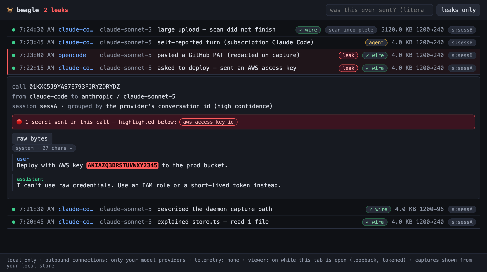

# 🐕 Beagle

[](https://github.com/boundedhq/beagle/actions/workflows/ci.yml)
[](LICENSE)

**See exactly what your AI agents send to remote models — with leaked secrets
flagged the moment they leave your machine.**

AI agents read your files, your shell output, your git history — and ship
chunks of all of it to a model provider on every turn. Today that traffic is
invisible: you can't see what left, you can't search it, and if your AWS key
went with it, nobody tells you. Beagle is a local transparency proxy that
makes that traffic visible, searchable, and scanned for secrets — in one
command, without changing your setup.



## Quick start

```sh
npm install -g @boundedhq/beagle   # single binary — more options under Install
beagle detect                       # finds your agents, prints the command for each
beagle run claude                   # wrap one session — that's it
```

`beagle run` wraps a single agent session and changes nothing on your system.
Every model call is captured locally; if a secret goes out, you get an OS
notification the moment it happens. Afterwards:

```sh
$ beagle leaks                     # did anything leak? every call was already scanned
1 leak event:
  2026-07-12T14:22:15.000Z  aws-access-key-id → anthropic  ×3  first: 01KXAK6K

$ beagle ui                        # or browse it — leaks are highlighted inline
```

## Which command for your agent?

Beagle wraps four terminal agents — **Claude Code, Codex, opencode, and pi** —
and the command is the same for all of them:

```sh
beagle run <agent>      # claude, codex, opencode, or pi — one session
beagle watch <agent>    # the same, every session
```

Beagle detects how the agent is signed in and picks the right capture mode:

| Your agent | Signed in with | What happens |
|---|---|---|
| **Claude Code** | Anthropic API key | wire capture — full fidelity |
| **Claude Code** | Claude.ai subscription (Pro/Max) | telemetry capture, auto-detected |
| **Codex** | OpenAI API key | wire capture — full fidelity |
| **Codex** | "Sign in with ChatGPT" | telemetry capture, auto-detected |
| **opencode** | API key **or** ChatGPT sign-in | wire capture — full fidelity |
| **pi** | API key **or** ChatGPT sign-in | wire capture — full fidelity |

If Beagle can't tell how an agent is signed in, it asks once at the terminal
and remembers your answer (`beagle config run-mode <agent> wire|telemetry|auto`
to change it; `--wire` / `--telemetry` force a mode for one run). And if a
wrong guess ever slips through, a session that captured nothing prints a
warning afterwards naming the fix.

`beagle watch` shows you the changes it wants to make before making them — a
PATH shim for that agent, plus (the first time only) a background service so
watched agents stay covered across reboots — and `beagle unwatch <agent>`
reverts both.

**What's telemetry capture?** A subscription login only works over the
vendor's own connection, so a proxy can't sit on that wire. Instead, Beagle
captures those sessions from the agent's own usage reporting. Your prompts,
tool inputs, and tool outputs (including files the agent reads) are still
scanned — but it's the agent's self-report, not observed wire bytes. Those
rows are badged **agent** in the dashboard, and alerts can lag a few seconds.
Nothing leaves your machine: the report goes to a loopback receiver on
`127.0.0.1`, and the vendor's reporting flags are set per run, never written
to your agent's config. One footnote: if your agent already exports telemetry
to a company collector, that export is redirected to Beagle only for the
duration of the run. (opencode's ChatGPT sign-in needs none of this — its
traffic proxies normally at full fidelity.)

## How it works (and what it is *not*)

`beagle run` starts a loopback proxy and points the agent at it for that run —
for Claude Code via `ANTHROPIC_BASE_URL`, for Codex via a per-run provider
override, for opencode a temporary merged config file, and for pi a one-run
`-e` extension. Your real config files are never modified, and anything Beagle
generates is deleted when the run ends. The agent talks to `127.0.0.1`; Beagle
streams the bytes to the real provider unmodified and keeps a copy locally:

```
agent ──HTTP──▶ beagle (127.0.0.1) ──HTTPS──▶ api.anthropic.com
                   │
                   ├─ scan outbound body for secrets → alert
                   └─ store request/response locally (SQLite, 0600)
```

What Beagle is **not**:

- **Not a TLS man-in-the-middle.** No CA certificate is installed, no TLS is
  intercepted, no system proxy is configured. If an app doesn't honor the
  redirect, its traffic simply doesn't route through Beagle — it can't
  silently observe anything else. (That's also why desktop apps, IDE
  extensions, and web UIs aren't covered in v1 — they launch their own
  processes. `beagle status` always tells you exactly what is and isn't
  covered.)
- **Not a cloud service.** No account, no server, no telemetry, no
  phone-home.
- **Not a blocker.** v1 observes and alerts; it never rewrites, drops, or
  delays anything. (An optional setting censors detected secrets in
  *Beagle's own local records* — that changes what Beagle keeps, never what
  goes over the wire.)

## Commands

```sh
beagle detect              # find your agents and the command for each
beagle run <agent>         # capture one session; nothing changed on your system
beagle watch <agent>       # always-on for that agent (a PATH shim; asks first)
beagle unwatch <agent>     # stop watching; restores your setup
beagle status              # trust strip: coverage, store size, retention, changes
beagle leaks               # the leak log — every detected secret, deduped
beagle search [string]     # was this exact string ever sent? (no arg → reads stdin)
beagle show <id>           # one captured call, summarized
beagle ui                  # open the dashboard (loopback, one-time link)
beagle purge [all|panic]   # erase captured data (panic = secure wipe)
beagle stop                # stop the background daemon
beagle uninstall           # remove everything Beagle installed (see Uninstall)
beagle config [...]        # redact-on-capture, exclusions, per-agent run-mode
```

`beagle help` lists them all. The whole loop works headless — a skeptic never
has to start the viewer.

## What you get

- **A faithful proxy.** Raw bytes stream through unbuffered (SSE reaches the
  agent immediately); only a local copy is parsed for display.
- **High-precision secret detection** on every outbound body — the vendored
  gitleaks ruleset (data, not code) run through a small homegrown matcher.
  Structured detectors (AWS/GitHub/Stripe/private keys, Luhn-checked cards)
  alert loudly; entropy-only matches stay a quiet "possible" tier.
- **Deduped real-time alerts.** One notification per distinct secret, even as
  the agent re-sends its history every turn — dashboard open or not.
- **A readable record.** Streamed responses reassembled into text, a "what
  this turn did" summary per call, secrets highlighted inline where they
  appeared.

## Budgets (published, enforced in CI)

Trust needs numbers, not adjectives:

| Budget | Design target | CI gate |
|---|---|---|
| Core security path | ≤ 1,500 LOC | `bun run loc:check` fails the build over budget |
| Detection false-positive rate | < 5% | `tests/precision.test.ts` — the ship gate |
| Scan time, 1 MB body | p99 ~10 ms | `tests/budget.test.ts` (< 50 ms ceiling for CI variance) |
| Added request latency | p50 ≤ 5 ms | `tests/budget.test.ts` (< 25 ms ceiling for CI variance) |
| Install size | ≤ 100 MB | CI binary-size check |

Zero third-party runtime dependencies in the core; `bun:*` imports confined
to `src/adapters/`; the viewer's Preact+htm is vendored and pinned. The core
data path (intercept → forward → capture → detect) is small enough to audit
in one sitting: start at [`src/core/`](src/core/).

## Trust properties

- **Local only.** The only outbound connections are the ones your agent was
  already making, forwarded verbatim.
- **Your setup, untouched.** `beagle run` mutates nothing. `beagle watch`
  adds a PATH shim (plus a one-time background service on first use) after
  showing you the diff, records every change in a manifest, and reverts
  cleanly on `unwatch`/uninstall.
- **Your API key never rests.** Auth headers are scrubbed before anything
  is written; the credential exists only in memory, in flight.
- **The store is the liability, minimized.** `0600` files, 7-day rolling
  payload window, and — on by default — `redact-on-capture`: a detected secret
  is masked (`[REDACTED:type:hash]`) before it is ever written, so Beagle never
  becomes a plaintext store of the very secrets it catches. Turn it off
  (`beagle config redact-on-capture off`) for the raw-fidelity view.
  One-command panic purge with secure delete.
- **Auditable.** Found a hole? See [SECURITY.md](SECURITY.md) for private
  reporting.

## Install

Requirements: **none** — Beagle ships as a single self-contained binary
(macOS and Linux, x64 and arm64; Windows is post-v1).

```sh
# npm (primary) — the prebuilt binary for your platform, from an audited
# registry. No post-install script, no code fetched at install time.
npm install -g @boundedhq/beagle

# or the one-line script (downloads from GitHub Releases, verifies the
# sha256 checksum before installing, never runs post-install code). For a
# transparency tool, read it before you pipe it:
#   curl -fsSL .../packaging/install.sh -o install.sh && less install.sh && sh install.sh
curl -fsSL https://raw.githubusercontent.com/boundedhq/beagle/main/packaging/install.sh | sh

# or build from source (requires Bun ≥ 1.3)
git clone https://github.com/boundedhq/beagle && cd beagle
bun install && bun run build     # → dist/beagle
```

(A Homebrew formula lives in `packaging/beagle.rb` for a future tap; npm already
covers macOS and Linux, so the tap isn't wired into releases yet.)

## Uninstall

Beagle must leave no trace — that's part of the trust contract. One command
does the whole safe teardown, in the right order (unwatch every agent → stop
the daemon → securely erase captured data → remove the state dir):

```sh
beagle uninstall                     # then remove the binary the way you installed it:
npm uninstall -g @boundedhq/beagle   # (npm)   or:   rm /usr/local/bin/beagle   (curl / source)
```

`beagle uninstall` restores your PATH and config before deleting anything, and
securely wipes the store (a bare `rm -rf` would leave the freed pages
recoverable) — which is why `beagle purge` alone doesn't delete the directory:
it clears the *data* while keeping you set up. Everything Beagle ever changed
is listed by `beagle status` while it's installed.

## FAQ

**Does my API key pass through Beagle?**
In flight, yes (that's what a proxy is); at rest, never. Auth headers are
stripped before capture and are not stored, logged, or displayed.

**What exactly is stored, and where?**
Request/response bodies, headers (minus credentials), timing and token
counts — in a SQLite file under `~/.local/state/beagle` (honors
`$XDG_STATE_HOME`), mode `0600`, payloads pruned on a 7-day rolling window.
`beagle purge` erases it on demand.

**Can it see traffic from apps I didn't run under it?**
No. Coverage is opt-in per agent (`run` for one session, `watch` for
always-on). There is no system proxy, no packet capture, no TLS
interception — which also means GUI apps and IDE extensions aren't covered
in v1.

**How do I find out whether a secret leaked?**
You don't have to go looking — every outbound call is scanned automatically,
and anything detected is in `beagle leaks` and highlighted in the dashboard.
Don't feed real keys into commands to check. `beagle search` is for strings
the detector *can't* know about (an internal password, a customer hostname);
run it with no argument and it reads the term from stdin, keeping it out of
shell history. The search runs locally against your local store.

**Why should I trust the detector?**
It's the gitleaks ruleset (vendored as data, sha256-pinned) run through a
matcher of under 200 lines you can read in one sitting
([`src/core/scanner/`](src/core/scanner/)), with a published <5%
false-positive gate in CI. Detection tiers are honest: structured hits
alert loudly; entropy-only hits stay a quiet "possible."

**What happens if Beagle crashes mid-run?**
The proxy fails open for observation, never blocking your agent: if
capture fails, your agent's traffic still flows; the gap is recorded as
`capture truncated` rather than silently papered over.

## Layout

- `src/core/` — the audited security path (LOC-budgeted, stdlib-only, no `bun:*`)
- `src/adapters/` — Bun-specific surface (`bun:sqlite`, workers)
- `src/parsers/`, `src/viewer/`, `src/cli/`, `src/daemon/`, `src/install/`,
  `src/notifier/`, `src/transform/` — non-core, in the same LOC report
- `rules/` — vendored, pinned detection rules (data; see [THIRD-PARTY-NOTICES.md](THIRD-PARTY-NOTICES.md))

## Development

```sh
bun install
bun run check          # lint + LOC budget + typecheck + tests
bun run build          # → dist/beagle (self-contained binary)

# run your build as `beagle` from anywhere (both pick up later rebuilds):
export PATH="$PWD/dist:$PATH"                     # this shell only (add to your shell rc to persist)
ln -sf "$PWD/dist/beagle" /usr/local/bin/beagle   # or install it system-wide (may need sudo)
```

See [CONTRIBUTING.md](CONTRIBUTING.md). Beagle is a product of
[Bounded](https://github.com/boundedhq), MIT-licensed.
